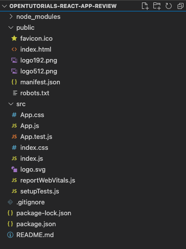

# opentutorials-react-app

- [인프런(생활코딩 - React)](https://www.inflearn.com/course/react-%EC%83%9D%ED%99%9C%EC%BD%94%EB%94%A9/dashboard
)
- [생활코딩 홈페이지](https://www.opentutorials.org/module/4058)
- [Youtube divide](https://www.youtube.com/playlist?list=PLuHgQVnccGMCRv6f8H9K5Xwsdyg4sFSdi)
- [Youtube long take](https://www.youtube.com/watch?v=mJ64l_iONqw&t=408s)

## 수업 소개
- javascript, class 등의 개념 이해 필요
- react는 페이스북에서 만든 자바스크립트 UI 라이브러리, 사용자 정의 태그(components)를 만들어 주는 여러가지 기술 중 하나
- react의 필요성
  - 가독성 증가
  - 재사용성 증가
  - 유지 보수 용이
- 컴포넌트를 중심으로 현대적 웹 UI 만드는 법 익히기
```
리액트 없이도 html 에서 include 쓰면 1,2,3 이 똑같이 충족되지 않는지요?
```

## 개발 환경
### 공부 전략
- 많은 절차를 필요로 하지만 다 공부하지 않고 중요한 부분만 공부
- coding -> run -> deploy

### 개발환경의 종류
- 강사로부터 독립하기 -> 공식 문서와 친해지기
- [react 홈페이지](https://ko.reactjs.org/) 시작하기
- 개발환경 셋팅
  - 온라인 상에서 리액트 애플리케이션 구현
  - 이미 만든 서비스에 추가(까다로울 수 있음)
  - 툴체인(Create React App)을 사용
- npm 은 nodejs계의 플레이스토어 혹은 앱스토어

### npm을 이용해서 create react app 설치
- npm은 일종의 앱스토어
- npm 설치 : [nodejs 설치](https://nodejs.org/ko/)
- 다운로드 확인 : npm -v
- npm install -g create-react-app <- 직접 다운로드
- npx create-react-app <- 임시 설치

### create react app을 이용해서 개발환경구축
- 리액트를 개발할 폴더를 생성
- 이미 다운로드 받아진 CRA에 해당 폴더에 개발환경 요구
- 각종 파일 및 폴더가 자동으로 생성됨
```sh
# Shell
create-react-app opentutorials-react-app
```

### 샘플 웹앱 실행
- visual studio Code를 통해 개발
- 실행부터 해보기 -> 최소한으로 구현된 샘플 앱이 실행됨
```sh
# Shell
npm run start

# 종료 
ctrl + c
```

### JS 코딩하는 법
- 디렉토리 구조 파악
<br><br>

- public에 index.html이 존재 -> 웹브라우저에서 index.html 실행한 결과
```html
<!-- public/index.html -->
  <body>
    <noscript>You need to enable JavaScript to run this app.</noscript>
    <div id="root"></div>
  </body>
```
- 코딩을 통해 생성되는 컴퍼넌트들은 id = "root" 의 하위에 들어가도록 약속함 (변경가능)
- root안에 들어가는 컴포넌트는 src 디렉토리 안의 내용임, src안에 원하는 내용을 코딩
- 진입 파일은 index.js 라는 파일
- index.js중 Document.getElementById('root')는 html에서 특정 태그를 선택자 문법
- <App \/> 사용자 정의 태그 -> 컴포넌트, 실체는 './App' (.js 생략됨)
- return 시, 1개의 태그만 리턴해야함
```js
// index.js
import React from 'react';
import ReactDOM from 'react-dom';
import './index.css';
import App from './App';
import reportWebVitals from './reportWebVitals';

ReactDOM.render(
  <React.StrictMode>
    <App />
  </React.StrictMode>,
  document.getElementById('root')
);
// ...
```
- 해당 수업에서는 클래스 컴포넌트만을 이용
```js
// App.js
import React, { Component } from 'react';
import './App.css';

class App extends Component {
  render() {
    return (
      <div className="App">
        Hello, React !!
      </div>
    )
  }
}

export default App;
```

### CSS 코딩하는 법
- CRA내 에서의 CSS 코딩
- 컴포넌트 명은 대문자로 시작해야함

### 배포하는 법
- 캐시 지우기 및 강력한 새로고침 시 1.7MB 사용 -> 무거움
- 개발환경 실행 시, npm run start
- 빌드 시, npm run build -> CRA가 소스파일 및 기타 재료를 간결하게 작성
- 웹서버의 다큐먼트 최상위 디렉토리에 build 내용물을 넣어야함
- 간단하게 웹서버 구동 -> 147KB 사용
```sh
# Shell
# npm 설치 
npm install -g serve

# 서버 작동
serve -s build // 웹 콘텐츠 root 경로 지정
# 혹은 npx 사용
npx serve -s build
```

## 컴포넌트 제작
### 리액트가 없다면
- symantic tag - 기능은 없고 의미만 있는 태그
- 가동성이 매우 떨어짐
- 재사용성도 떨어짐
- 유지보수가 불편
```html
<!-- test.html -->
<html>

<body>
  <header>
    <h1>WEB</h1>
    World Wide Web!
  </header>

  <nav>
    <ul>
      <li><a href="1. html">HTML</a></li>
      <li><a href="2. css">CSS</a></li>
      <li><a href="3. javascript">JavaScript</a></li>
    </ul>
  </nav>

  <article>
    <h3>HTML</h3>
    HTML is HyperText Markup Language.
  </article>
</body>

</html>
```

### 컴포넌트 만들기 1 & 2
- 컴포넌트는 정리 정돈 상자, 사용자 정의 태그
- test.html파일을 react로 바꾸어 보기
  - header을 Subject라는 이름의 태그(컴포넌트)로 바꾸기
  - App.js에 컴포넌트 만드는 코드(템플릿)가 있으니 참고
```js
// App.js App Component
// ...
class App extends Component {
  render() {
    return (
      <div className="App">
        <Subject />
      </div>
    )
  }
}
// ...
```
- 자바스크립트 최신 스팩에서는 class 내부의 함수는 function 키워드 생략
- render() 함수는 필수이며, 컴포넌트는 반드시 하나의 태그로 시작해야하며,컴포넌트 명은 대문자로 시작해야함
- class 부분 코드는 자바스크립트가 아님(거의 비슷)
  - 태그를 문자열로 표현해야하지만 까다로움으로 페이스북에서 JSX 포맷을 만들어 지정
  - CRA가 알아서 JS와 HTML로 컨버팅해줌
- 컴포넌트는 클래스 형과 함수형이 있으며, 차이점이 존재
```js
// App.js
import React, { Component } from 'react';
import './App.css';

class Subject extends Component {
  render() {
    return (
      <header>
        <h1>WEB</h1>
        World Wide Web!
      </header>
    );
  }
}

class TOC extends Component {
  render() {
    return (
      <nav>
        <ul>
          <li><a href="1. html">HTML</a></li>
          <li><a href="2. css">CSS</a></li>
          <li><a href="3. javascript">JavaScript</a></li>
        </ul>
      </nav>
    );
  }
}

class Content extends Component {
  render() {
    return (
      <article>
        <h3>HTML</h3>
        HTML is HyperText Markup Language.
      </article>
    );
  }
}

class App extends Component {
  render() {
    return (
      <div className="App">
        <Subject />
        <TOC />
        <Content />
      </div>
    )
  }
}

export default App;
```

### props
- 태그에서는 이름(a, div)이라는 공통점과 속성(attribute)을 통해서 재사용성이 높은 부품을 만들어냄
- 단순히 한가지 내용만을 나타낼 수 있는 컴포넌트는 효율성이 떨어짐
- 사용자 정의 태그인 컴포넌트도 속성(attribute)을 이용하여 나타낼 수 있음
- 컴포넌트에서는 프롭스(props)이라는 차이점으로 각각의 컴포넌트에 의미를 전달할 수 있음 -> 마치 함수의 파라미터 처럼...
- 컴포넌트들 간의 데이터를 공유(상위 -> 하위)하여 사용할 수 있음
- 사용법은 하위 컴포넌트에서 {this.props.name} 로 사용!
```js
// App.js
class Content extends Component {
  render() {
    return (
      <article>
        <h3>{this.props.title}</h3>
        {this.props.desc}
      </article>
    );
  }
}

class Subject extends Component {
  render() {
    return (
      <header>
        <h1>{this.props.title}</h1>
        {this.props.sub}
      </header>
    );
  }
}

class App extends Component {
  render() {
    return (
      <div className="App">
        <Subject title="Web" sub="World Wide Web!" />
        <TOC />
        <Content title="HTML" desc="HTML is HyperText Markup Language." />
      </div>
    )
  }
}
```
- props의 default 값을 설정할 수 있음
```js
class MyComponent extends Component {
  static defaultProps = {
    name : 'default_value'
  }
}
// 혹은
MyComponent.defaultProps = {
  name: 'default_value'
};
```

### React Developer Tools
- 설명서(스펙) 잘 읽기
- 측정과 분석, 탐구 -> 툴과 친해지기
- 질문과 검색
- tool/debugging - chrome 웹 스토어 - React Developer Tools 사용
- 실제 코드가 아닌 react상의 컴포넌트를 보여줌 + props 값을 변경하고 실시간으로 확인도 가능

### Component 파일로 분리하기
- 여러가지 Component가 한 파일에 있음
  - 다른 Component에서 재사용하기 어려움
  - 너무 많아지면 관리도 어려움
- Component 정리 작업
  - 각각의 컴포넌트 별로 별도의 파일로 쪼개자
  - 해당 클래스만 외부에서 사용할 수 있게 허용 export default ~~~~;
- Content -> ./components/Content.js
```js
import React, { Component } from 'react';

class Content extends Component {
  render() {
    return (
      <article>
        <h3>{this.props.title}</h3>
        {this.props.desc}
      </article>
    );
  }
}

export default Content;
```
- Subject -> ./components/Subject.js
```js
import React, { Component } from 'react';

class Subject extends Component {
  render() {
    return (
      <header>
        <h1>{this.props.title}</h1>
        {this.props.sub}
      </header>
    );
  }
}

export default Subject;
```
- TOC -> ./components/TOC.js
```js
import React, { Component } from 'react';

class TOC extends Component {
  render() {
    return (
      <nav>
        <ul>
          <li><a href="1. html">HTML</a></li>
          <li><a href="2. css">CSS</a></li>
          <li><a href="3. javascript">JavaScript</a></li>
        </ul>
      </nav>
    );
  }
}

export default TOC;
```
- 정리 완료된, 간결해진 상태의 App.js
```js
import React, { Component } from 'react';

// components
import Content from './components/Content'
import Subject from './components/Subject'
import TOC from './components/TOC'

// CSS
import './App.css';

class App extends Component {
  render() {
    return (
      <div className="App">
        <Subject title="Web" sub="World Wide Web!" />
        <TOC />
        <Content title="HTML" desc="HTML is HyperText Markup Language." />
      </div>
    )
  }
}

export default App;
```

## state
### State 소개
- props는 사용자가 컴포넌트를 사용하는 입장에서 중요
- State는 props의 값에 따라 내부의 구현에 따라 필요한 데이터
- 컴포넌트간 데이터를 주고 받는 방법 및 컴포넌트 내에서 사용(읽기)하는 법!

### State 사용
- props 값이 하드코딩 되어있음
- 이 값(title="WEB")을 State로 만들고, State값을 하위 컴포넌트에 props로 전달함으로 개선
- 상위 State로 전달, 하위에 props로 사용
- 생성자(constructor)를 통해 Component(State)값을 초기화
- 실행순서 constructor -> render 

### key
- State 여러개 설정 및 반복문으로 lists 생성
- lists 자동 생성 시, key 값 입력 해주어야함

## 이벤트
### 이벤트 state props 그리고 render 함수
- 애플리케이션을 조금 더 역동적으로 만들어 줌
- 목표 : 단순 데이터 전달이 아니라 사용자와의 상호작용!
  - 이벤트 발생 시, App 컴포넌트의 state가 변경 
  - 변경된 state가 하위 컴포넌트에 props로 전달됨으로써 동적으로 애플리케이션이 변경
- props, state가 변경될 시, 해당 state를 가지는 Component의 render가 재실행됨 
  - 화면이 다시 그려짐

### 이벤트 설치
- 이벤트를 발생시키려면 이벤트를 만들어야함(설치)
- a 태그를 클릭시 해당 주소로 이동하는 것이 본래 a 태그의 역활
  - react에선 페이지 전체가 리로딩(랜더링)이 아닌 해당 이벤트 관련 내용만 변경을 원함
  - 기존에는 onclick 사용, react에서는 onClick={funcition()} 이라는 이벤트=함수를 사용
  - preventDefault로 기본적인 동작(이벤트)을 방지
- 컴포넌트 사용 시, 데이터를 전달할 뿐만 아니라 함수(이벤트)도 프롭스를 통해 전달할 수 있음
  - 상위 컴포넌트에서 하위 컴포넌트로 전달한 함수(이벤트)를 실행
  - 실행의 결과로 상위 컴포넌트의 state변경 -> 상위 컴포넌트가 render 됨

### 이벤트에서 state 변경하기
- this.state.mode = "welcome" 으로 state 변경?
  - 이벤트 내에서 this를 바로 사용 시, 컴포넌트를 가르키는 것이 아니라 아무런 값이 셋팅되어있지 않음
  - bind(this) 사용하여 컴포넌트를 가르키게함
- 그러나 이렇게 해도 안됨! 이유? 리액트는 이런 방법 사용 시, state 값이 변경된 것을 모름
  - 리액트가 원하는 방법으로 state를 변경해주어야함!
  - this.setState() 함수를 사용하여 state를 변경

### 이벤트 bind 함수 이해하기
- bind : 엮다, 묶다
- render안에서 this는 render함수가 속해있는 컴포넌트 자체를 가르킴!
- 함수 안에서 this는 아무 값도 없음
- bind를 통해 this를 연결해주자
- var C = A.bind(B) 
  - A라는 함수 안에서 this는 B가 되도록 연결한 함수 C를 새롭게 생성

### 이벤트 setState 함수 이해하기
- state 값의 변경 시 직접 변경? VS setState 사용?
  - 생성자 실행 시에는 직접 변경해도됨
  - 이미 컴포넌트가 끝난 시점에서는 안됨 -> 리액트 모르게 바꾼셈! (변경되기는 함...)
  - setState를 통해 객체 형태로 값을 전달해 주어야함 

### 컴포넌트 이벤트 만들기 1 & 2 & 3
- 변경되어야할 상태를 state(selected_content_id)로 생성
- 하위 컴포넌트(TOC)에서 상위 컴포넌트로 선택된 데이터(data[i].id)를 보내 주어야함 
- 프롭스로 전달받은 함수 인자에 결과 값 입력
1. event target 이용
  - event객체는 target이라는 속성을 가지며, target은 이벤트가 일어난 태그를 가르킴
  - data- 라는 이름의 속성은 target의 dataset에서 확인 가능
  - Number() 은 문자를 숫자로 변경해줌
2. bind(this, data)로 데이터 전달
  - data 작성 시, 함수 내에서 1번째 파라미터로 사용 가능
- 전달 받은 후 setState를 통해 state 변경 -> render 실행

## Create 기능 구현
### 베이스 캠프
- props와 state 차이
  - 변경 가능 여부
  - props는 하위 컴포넌트에서 변경 불가, 금지되어있음
  - state는 setState를 통해 변경 가능
- props와 state 공통점
  - 변경 시, render 함수 호출 유발

- 하위 컴포넌트에게 데이터 전달 시, 프롭스를 사용
- 상위 컴포넌트에게 데이터 전달 시, 이벤트를 사용 및 구현
  - 실행 시 상위 컴포넌트의 state값을 변경(setState)

- redux 
  - 데이터를 분산하여 저장하는 것이 아니라 하나의 저장소에 저장
  - 변경 시, 관련된 컴포넌트에서 render 진행

### create 구현 : 소개
- CRUD : Create, Read, Update, Delete

### create 구현 : mode 변경 기능
- delete 기능의 경우, 링크로 생성하게되면 위험할 수 있음
- 이벤트가 실행되었을때, 실행되는 함수를 핸들러라고 함

### create 구현 : mode 전환 기능
- state 값(상황, 상태)에 따라 컴포넌트를 교체
- 변수를 만들고 그 변수에 컴포넌트를 상황에 따라 저장하여 사용

### create 구현 : form & onSubmit 이벤트 & contents 변경
- 입력 형태 창 form, html 기본 태그
  - 속성 action : 어디로 보낼지
  - 속성 method : post <- post로 보내야 데이터가 노출되지 않음
- onSubmit form이 고유하게 가지는 기능을 이용하여 이벤트 생성
  - 기본적으로 페이지가 변경되지만 preventDefault를 이용하여 이를 방지
1. 하위 컴포넌트(form 내용)에서 입력된 데이터를 어떻게 상위 컴포넌트로 넘겨 줄 것인가
  - 프롭스로 전달받은 함수 인자에 결과 값 입력
  - 데이터 확인 방법? 이벤트 내의 event의 target을 잘 분석해 볼것!
2. 상위 컴포넌트에서 어떻게 데이터를 변경(state.content)할 것인가
  - 이벤트 연결 후, 일단 잘 받아오는지 출력
  - setState를 통해 데이터 변경
  - 배열에 push 후, 데이터 변경(setState)은 성능 개선 시 까다로움
  - concat 사용, 원본을 변경하지 않음(순수 함수...?)

- UI에 영향을 주지않는다면 굳이 state 값으로 할 필요가 없음 
  - 설정하게 되면 불필요한 랜더링이 발생할 수 있음

### create 구현 : shouldComponentUpdate(newProps, newState)
- push는 안 되고? concat은 되고? 왜???
- 관련 없는 컴포넌트가 랜더링 되는 것은 비효율적!
- 개발자가 특정 상황에 대해 컴포넌트가 랜더링 될지 결정할 수 있음
- shouldComponentUpdate는 render이전에 실행
- 리턴 값(boolean)을 통해 render의 실행 여부를 결정할 수 있음
- shouldComponentUpdate 이전 값(this.props)에 접근할 수 있음
- push 방식으로 구현하게 되었을 경우, 이전 값(this.props)이 현재 값(newProps)와 같아짐

### create 구현 : immutable
- 원본을 바꾸지 않는다 : 불변성(immutable)
- var B = Array.from(A) A로 새로운 배열(B)를 만든다.
- var B = Object.assign({추가될 속성 정의},A) A로 새로운 객체(B)를 만든다.
- immutable js 를 통해 원본을 바꾸지 않고 조작 가능 -> 일관된 코드를 사용할 수 있음

## Update & Delete 기능 구현
### update 구현
- read, create의 결합
- Content 결정 로직 부분을 함수로 분리, render 함수를 간결하게
- 현재 선택된 Content 데이터를 업데이트 컴포넌트에 전달

### update 구현 : form
- 받아온 데이터를 화면에 뿌려주고 수정할 수 있게 하기
- value에 값을 넣어버리는 경우, props를 사용하기 때문에 변경이 불가능
```
Warning: You provided a `value` prop to a form field without an `onChange` handler. 
This will render a read-only field. If the field should be mutable use `defaultValue`. Otherwise, set either `onChange` or `readOnly`.
```
- 변경 가능하게 state화 -> 그러나 여전히 readOnly
  - onChange 함수를 통해 진행해야함 setState를 쓰는 이유와 유사한 느낌..?
- 중복 코드 제거! 
  - title, desc 대신 [e.target.name] 사용
  - bind도 정리

### update 구현 : state 변경
- 글의 고유 Id도 관리 input hidden 사용
  - 진행하지 않아도 되지만 기본적인 구현에 충실 
- 상위 컴포넌트 onSubmitComponent 구현
  - immutable을 위해 원본 데이터 복사
  - id 값이 같은 객체만 데이터 변경(setState)
- 변경된 화면(read)으로 이동... 어떻게? mode, selected_content_id 변경!

### delete 구현
- read 상태에서 delete진행
- 모드가 선택된 이후 바로 진행? 

## 수업을 마치며
- immutable js
- react router
- npm run eject
- redux plugin
- react server side rendering
- react native

## 읽을 거리
- props 와 state 차이
  - https://velopert.com/3629
  - https://studyingych.tistory.com/52

- 클래스, 함수 컴포넌트의 차이
  - https://velog.io/@sdc337dc/0.%ED%81%B4%EB%9E%98%EC%8A%A4%ED%98%95-%EC%BB%B4%ED%8F%AC%EB%84%8C%ED%8A%B8

- 참고할만한 링크
  - https://velopert.com/
